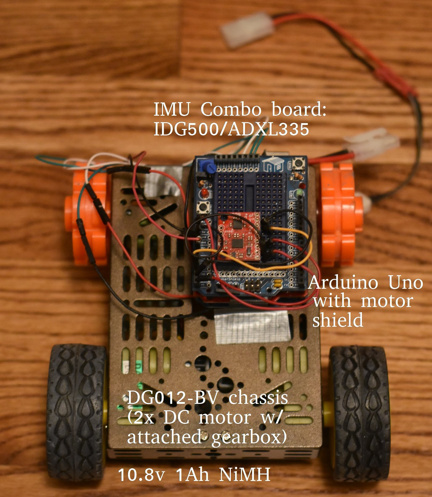
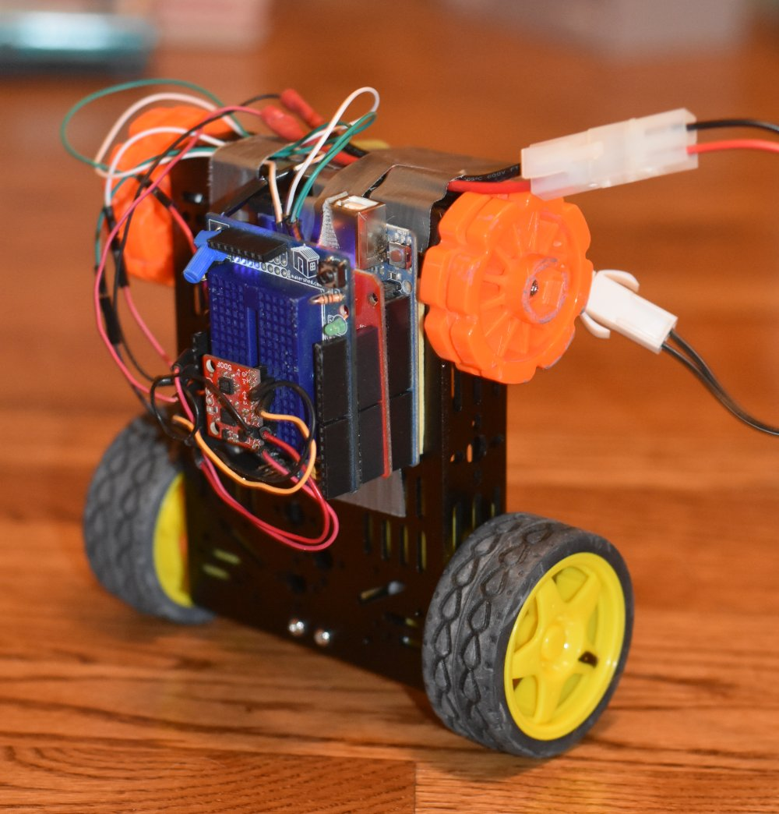

Arduino Cartpole
================

First, a disclaimer: this code will be more useful to you
as a reference than as something you should run. It relies on
some unusual tools as far as Arduino is concerned (i.e.
arduino-cmake), and isn't plug-and-play with the Arduino IDE.
Also, I don't know how you'd ever replicate my hardware.

But here's a video if it working! (Click to go to video)

[](https://www.youtube.com/watch?v=lBsVZufOAXM "Video")


Hardware
============




Software
============

Bug me if things don't work and I can try to help out. The gist of
things is that this package is built with CMake, and assumes a handful
of dependencies, which are resolvable on Ubuntu 16.04 (and probably others)
with:

```
sudo apt-get install gcc-avr binutils-avr avr-libc avrdude
sudo apt-get install git make gcc ant openjdk-8-jdk
sudo pip install numpy pyqt4 pyqtgraph serial
```

The control code is in `src_arduino/cartpole_plant.cpp`. This is an Arduino sketch (probably could be copy-pasted into the Arduino IDE) for controlling the cartpole.

Some hacky interface code is available in `scripts/serial_monitor.py`. It uses PyQt and pyserial to plot data streaming from the Arduino. It's ugly but functional for understanding what the thing is doing if you're tuning it...

The udev rule (with convenient installation script) in `udev` aliases an Arduino Uno to `/dev/cartpole_uno` with reasonable permissions, which is super convenient when you're plugging and replugging a lot. The build script assumes that this is where an Arduino will be found, but you can change this in `src_arduino/CMakeLists.txt` if you want.

Feel free to contact me with questions!